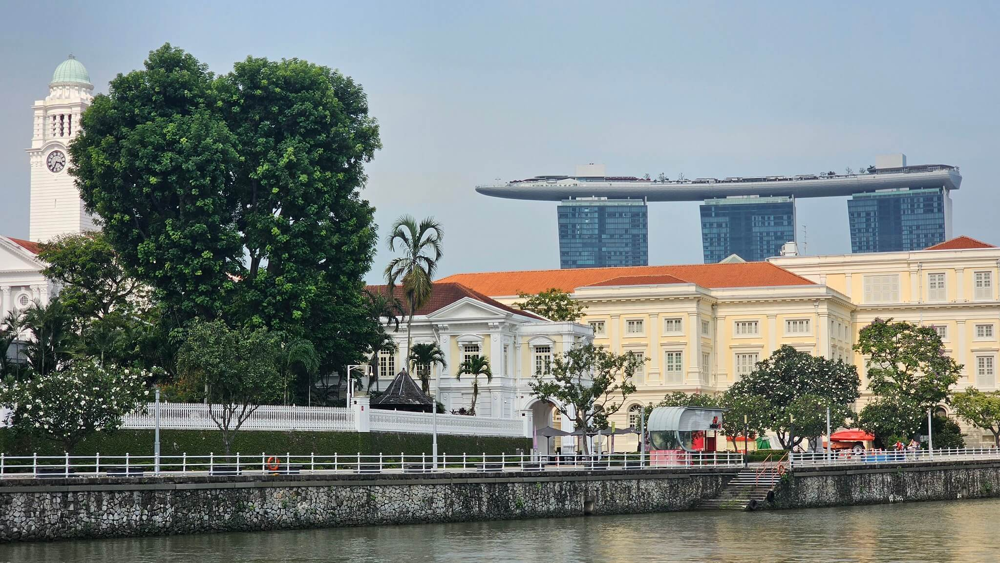
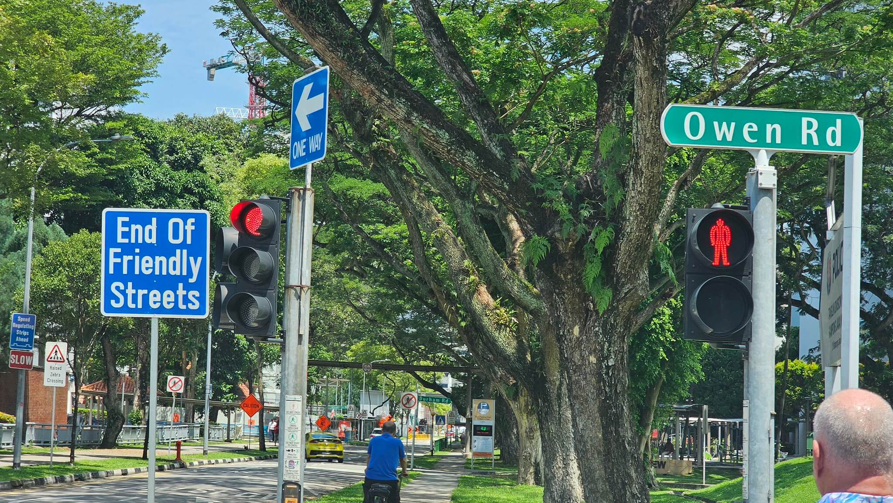
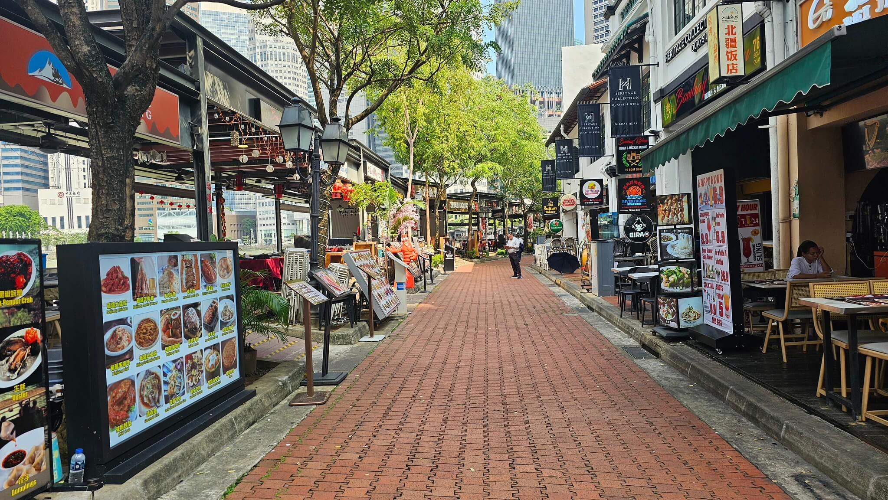
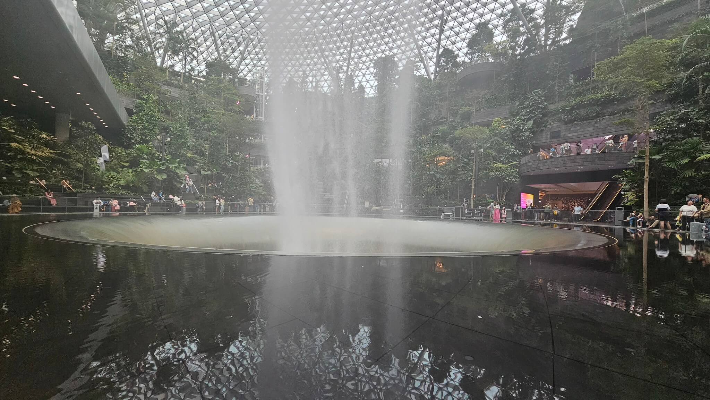

# Demonstration Deck

---
title: Markdown Slides Editor demo deck
lang: en
theme: default-high-contrast
durationMinutes: 20
slideWidth: 1280
slideHeight: 720
themeStylesheet:
titleSlide: true
subtitle: A starter deck that shows the main slide patterns
date: 2026-03-22
location: Toronto
speakers: Alex Example; Sam Example
closingSlide: true
closingTitle: Questions?
closingPrompt: Thanks for following along. Here is how to keep the conversation going.
contactUrl: https://example.com/slides
socialLinks: Mastodon @example; Bluesky @example.com
presentationUrl: https://example.com/slides/demo-deck
---

# Just text

This is a simple text slide. Use it when one clear idea deserves the full attention of the room.

Note:
Keep text slides short enough that they can be read quickly without pressure.

---

# Big statement

::center
**One clear idea is more powerful than ten crowded bullet points.**
::

Note:
A big statement slide works well as a transition between sections or to emphasise a key principle.

---

# Key number

::center
**73%**

of people retain a message better when it is paired with one strong visual.
::

Note:
Lead with the number, then give the single sentence that makes it meaningful.

---

# Quote or callout

::quote
Accessibility is a quality issue, not a feature request.
::

::callout
Use callouts when you want a strong takeaway to stand out visually.
::

Note:
Quotes and callouts are useful when you want emphasis without adding a dense block of bullets.

---

# Bullets

- Start with the core point
- [>] Reveal a supporting detail when you are ready
- [>] Keep bullets short enough to scan quickly
- [>] Split crowded slides before they become hard to read

Note:
Progressive disclosure can help you pace the room without putting every detail on screen at once.

---

# Numbered steps

1. Define the goal clearly
2. Identify the audience and their needs
3. Draft the key message for each slide
4. Review for density and cut where possible
5. Add speaker notes for every slide

Note:
Use numbered lists when order matters — processes, instructions, or ranked priorities.

---

# Text and bullets

Slides can mix a short paragraph with a list when that helps provide context.

- Introduce the idea
- Support it with two or three points
- Leave the deeper detail for notes or script

Resources:
- [Accessible Presentations](https://www.w3.org/WAI/presentations/)

Script:
If you need a fuller written script for delivery support or advance sharing, include it here instead of putting all of that text on the slide.

---

# Before and after

::column-left
## Before

- Dense walls of text
- Small fonts hard to read
- No clear hierarchy
::

::column-right
## After

- One idea per slide
- Readable font sizes
- Clear headings and short bullets
::

Note:
Before-and-after columns work well for comparisons, improvements, or contrasting perspectives.

---

# Centered content

::center

::

::center
A centered image or statement works well when you want a simple visual moment.
::

---

# Image only

::center

::

Note:
A full-width image with no body text is a strong way to open or close a section, or to let a photograph speak for itself.

---

# Hero image layouts

Use the image-hero layout when one photograph should carry the slide and the on-screen text can stay very short.

- Keep overlay text brief
- Add descriptive alt text
- Put detail in notes and resources

Note:
The next slides show the main hero-image variations directly in the starter deck so they are easy to test.

---

# Default hero
## Bottom-left overlay, hidden heading

::image-hero

Note:
This is the default hero-image layout: bottom-left overlay text, no logo, with the Markdown heading kept for navigation but hidden on screen.

---

# Hero top left
## Add a logo in the opposite corner

::image-hero text-top-left logo-bottom-right

---
Open with context
---

# Hero top right
## Swap the overlay and logo corners

::image-hero text-top-right logo-bottom-left

---
Show the evidence
---
<svg xmlns="http://www.w3.org/2000/svg" viewBox="0 0 160 56" role="img" aria-label="Example badge"><rect width="160" height="56" rx="12" fill="#ffffff"/><text x="80" y="35" text-anchor="middle" font-size="22" font-family="Arial, sans-serif" fill="#1b4965">Badge</text></svg>
::

Note:
Use this when the important part of the image needs to stay visible on the left side.

---

# Hero bottom right
## Keep the heading visible when needed

::image-hero text-bottom-right logo-top-left show-title show-subtitle

---
Make the title visible
---
<svg xmlns="http://www.w3.org/2000/svg" viewBox="0 0 160 56" role="img" aria-label="Example flag"><rect width="160" height="56" rx="12" fill="#ffffff"/><text x="80" y="35" text-anchor="middle" font-size="24" font-family="Arial, sans-serif" fill="#3a506b">Flag</text></svg>
::

Note:
This variant keeps both the slide title and subtitle visible while also placing a logo in the top-left corner.

---

# Hero center
## Center the message over the image

::image-hero text-center logo-top-right

---
**Design** for trust
---

::

Note:
Centered overlay text is useful when the message should feel like a title card instead of a caption.

---

# Timed hero reveal
## Wait a moment for the full transition

::image-hero stay-2 transition-6 final-0.2

---
See the idea land
---
Note:
Wait a second or two after the slide becomes active to see the reveal begin, then let the transition finish before advancing.

---

# Image-only hero
## Full-bleed visual pause

::image-hero

::

Note:
This is the full-bleed image-only hero variant, with no overlay text and no logo.

---

# Left and right columns

::column-left
## Left column

- Primary points
- Short bullets
- Main argument
::

::column-right
## Right column

Supporting text, examples, references, or a short quote can live here.
::

Note:
Columns work best when both sides stay balanced and readable.

---

# Image with supporting text

::media-left

---
Use media-left when you want the visual lead and the explanation to wrap alongside it.

- Start with the visual anchor
- Add only the essential interpretation
- Keep details in notes or script
::

---

# Image with supporting text (text-first)

::media-right

---
Use media layouts when a visual and a short explanation need to sit together on one slide.

- Keep the image relevant
- Give it meaningful alt text
- Avoid crowding the companion text
::

---

# Questions for the audience

- What is the single idea people should remember?
- What references should travel with the deck?
- What belongs on the slide, and what belongs in notes?

Note:
Question slides can invite interaction without needing a special visual treatment.

---

# Resources and follow-up

- [WCAG 2.2 Overview](https://www.w3.org/WAI/standards-guidelines/wcag/)
- [WAI Presentations Guidance](https://www.w3.org/WAI/presentations/)
- [Intopia: How to create more accessible presentations](https://intopia.digital/articles/how-to-create-more-accessible-presentations/)
- [Inklusiv](https://inklusiv.ca/)

Note:
Replace this sample deck with your own material, but keep the patterns that help you present clearly.
